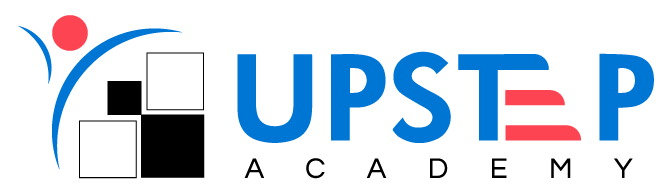

<!-- Replace the image URL below with your actual company logo -->

  

<h1 align="center">UpstepOperations</h1>

  <b>Automation for Chess Academy Operations — Save Time, Focus on Winning</b>

---

## 🎯 About Us

**UpstepOperations** is the operations automation division of our chess company.  
We build powerful tools to streamline scheduling, leave tracking, substitutes, and more — ensuring smooth operations so your coaches and students can focus on the game.

---

## 🚀 Our Services

✅ Develop web apps for coach scheduling & attendance  
✅ Automate batch and slot generation  
✅ Track leave, create substitute slots automatically  
✅ Monitor class progress with dashboards  
✅ Integrate systems for operations excellence

---

## 🌐 Connect with Us

  
  
  

---

## 📊 Our GitHub Stats

  

